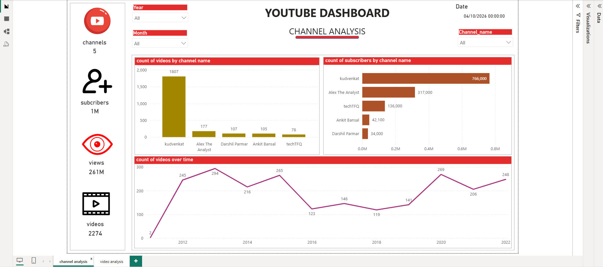
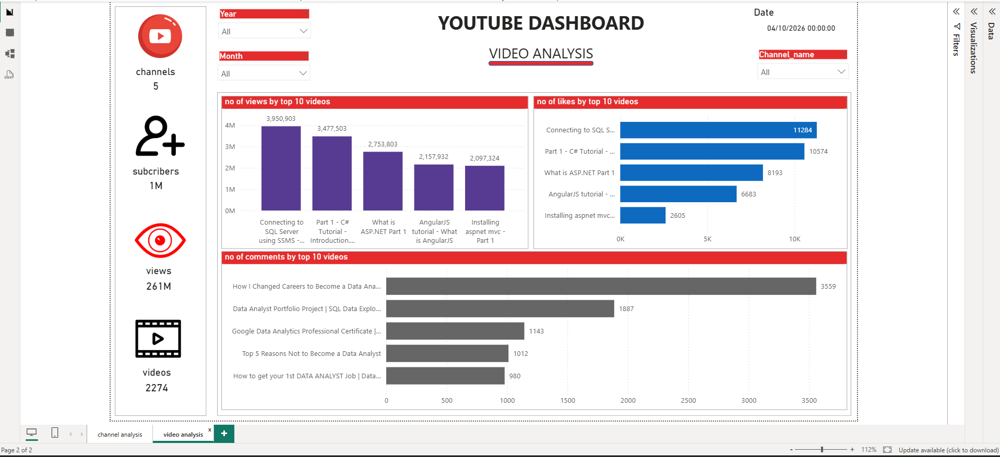
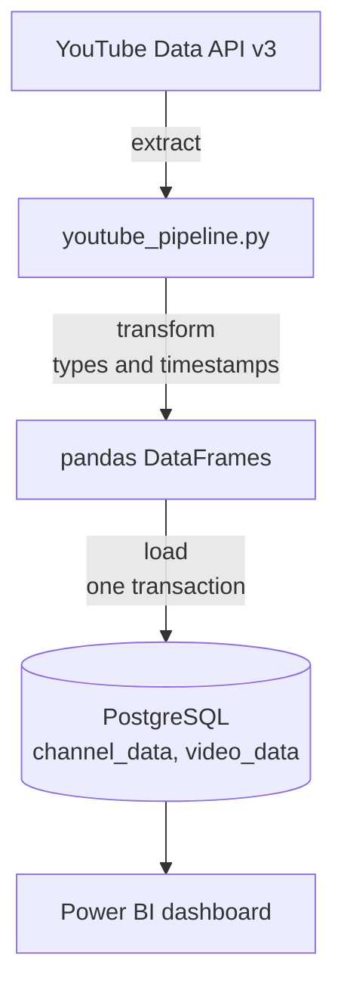

# YouTube Channel Analytics: API → PostgreSQL → Power BI

A Python pipeline that pulls channel and video statistics for five data-education YouTube channels from the YouTube Data API, loads them into PostgreSQL, and feeds a Power BI dashboard comparing their growth and engagement.

**At a glance:** 5 channels · 2,274 videos · 261 million views · about 1.3 million subscribers (data collected in 2022).





## Tech stack

Python · YouTube Data API v3 · pandas · SQLAlchemy · PostgreSQL · Power BI

## How it works



1. **Extract:** one API request returns the subscriber count and uploads playlist for all five channels. The script then pages through each playlist, 50 videos per request, and fetches every video's title, publish date, views, likes and comments in batches of 50.
2. **Transform:** converts the API's text values into numbers and dates, and stamps every row with the extraction time.
3. **Load:** replaces both tables in a single transaction, so the dashboard never reads a half-finished refresh.
4. **Visualise:** the Power BI report reads the two tables, joined on `Channel_id`, and filters by year, month and channel across two pages:
   - **Channel analysis:** videos and subscribers per channel, and videos published per year.
   - **Video analysis:** the most-viewed, most-liked and most-commented videos.

## What the data shows

- **Kudvenkat** dominates on volume and audience: about 1,800 videos (roughly 80% of the total) and 766,000 subscribers.
- **Alex the Analyst** has the second-largest audience (317,000) from fewer than 200 videos, and the most-commented videos are almost all his career-advice content.
- The most-viewed and most-liked videos are older programming tutorials (SQL Server, C#, ASP.NET), which keep collecting views years after publishing.
- Publishing across the five channels peaked around 2013 and again in 2020.

## Channels analysed

techTFQ · Darshil Parmar · Kudvenkat · Alex the Analyst · Ankit Bansal

## Design decisions

- **Batched API calls.** The API returns at most 50 items per request, so video details are fetched 50 at a time. This keeps the daily API quota usage low.
- **Handles hidden stats.** Creators can hide like counts or turn off comments. Those values come back missing, and the pipeline stores them as nulls instead of crashing.
- **Credentials outside the code.** The API key and database details live in a `.env` file, which `.gitignore` keeps out of the repo.
- **Atomic refresh.** Both tables are replaced inside one transaction.

## Repository structure

```
├── youtube_pipeline.py     # extract, transform and load
├── youtube_dashboard.pbix  # Power BI report
├── requirements.txt
├── .env.example            # settings to copy into .env
├── dashboard-channels.png  # screenshot: channel analysis page
└── dashboard-videos.png    # screenshot: video analysis page
```

## How to run

1. Create a YouTube Data API v3 key in [Google Cloud Console](https://console.cloud.google.com/apis/library/youtube.googleapis.com) and have a PostgreSQL database ready.
2. Install the dependencies:
   ```bash
   pip install -r requirements.txt
   ```
3. Copy `.env.example` to `.env` and fill in your API key and database details.
4. Run the pipeline:
   ```bash
   python youtube_pipeline.py
   ```
5. Open `youtube_dashboard.pbix` in Power BI Desktop, point its data source at your database, and refresh.

## Limitations and next steps

- **Snapshot only.** Each run replaces the tables, so the dashboard shows totals at the time of extraction (2022) rather than growth over time. Appending a dated snapshot each run would allow trend analysis.
- **Runs on demand.** A daily schedule (cron, or an orchestrator) would keep the data current.
- **Fixed channel list.** The channels are set in the script; reading them from a config file would make the pipeline reusable.
